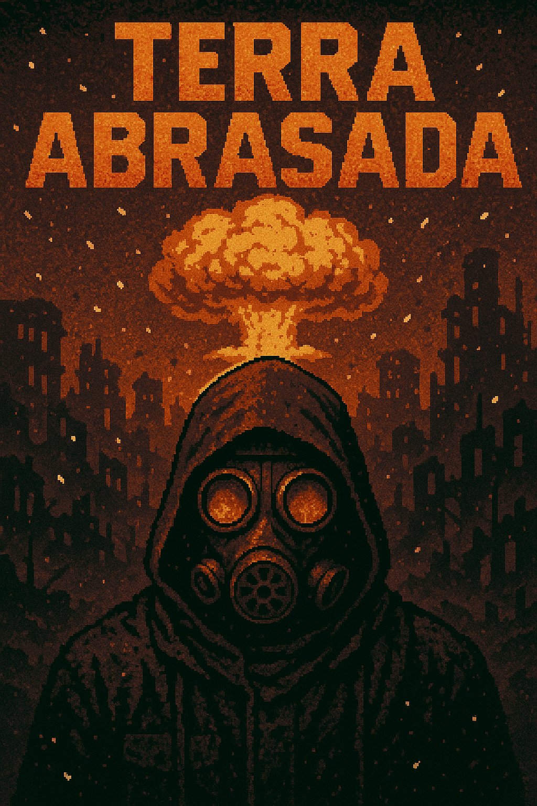

# ☢️ Terra Abrasada 




Uma experiência narrativa e estratégica ambientada em um mundo devastado por um desastre nuclear. Você é um sobrevivente em busca de recursos, abrigo e respostas. Gerencie seus recursos, tome decisões críticas e interaja com um mundo hostil.

---

## Sobre o Projeto

Este jogo é uma evolução do projeto desenvolvido na disciplina **Sistemas de Banco de Dados 1** ([repositório original](https://github.com/SBD1/2025.1-grupo8-Terra_Morta)). Agora, com foco em jogabilidade, narrativa interativa e uma arquitetura de dados mais sólida.

A proposta central é unir entretenimento e aplicação prática de conceitos de banco de dados relacionais. Todo o backend do jogo é orientado por SQL: desde controle de inventário e progresso do jogador até a interações com NPCs.

> Este é um jogo totalmente em texto, jogado via terminal.

---

## Estrutura Geral

- **Frontend (gameplay)**: Interface jogável no terminal, com foco em decisões estratégicas e exploração.
- **Banco de Dados**: PostgreSQL, modelado para representar personagens, recursos, locais e eventos.
- **Lógica de Jogo**: Scripts Python para interagir com o banco de dados.

---

## Conceitos SQL Aplicados

- Consultas aninhadas e agregações
- Views e Stored Procedures
- Gatilhos (Triggers) para eventos dinâmicos
- Normalização de tabelas
- Integridade referencial com Foreign Keys
- Controle de transações para garantir consistência dos dados

---

## 🔥 Diferenciais desta Versão

- Estrutura do projeto mais limpa
- Narrativa ramificada com consequências persistentes
- Sistema de gerenciamento da base
- Melhorias do combate

---

# Como Rodar o Projeto

## 1. Configuração do Ambiente

Crie um arquivo `.env` na raiz do projeto com o seguinte conteúdo:

```env
DB_NAME=TerraAbrasada
DB_USER=postgres
DB_PASSWORD=
DB_HOST=localhost
DB_PORT=5432
```


> 💡 Preencha o campo `DB_PASSWORD` com a senha do seu usuário PostgreSQL.

---

## 2. Execução dos Scripts SQL

No PostgreSQL, execute os arquivos a seguir **nesta ordem**:

1. tables.sql
2. stored_procedure.sql
3. triggers.sql
4. insertions.sql

-------

## 🚧 Status do Projeto

Em desenvolvimento ativo. Esta versão visa alcançar um MVP jogável com um ciclo básico de sobrevivência, decisões morais e persistência de dados.

---

## 📌 Repositório de Origem

Projeto original da disciplina de Sistemas de Banco de Dados I:  
https://github.com/SBD1/2025.1-grupo8-Terra_Morta

---
